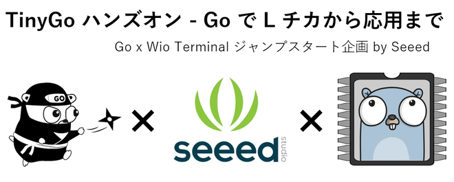  
https://gocon.connpass.com/event/226098/

このページは 2021/11/13 に開催される Go Conference 2021 Autumn 内の Wio Terminal を使った TinyGo ハンズオン用の記事です。不明点は、このページのコメントや [twitter:sago35tk](https://twitter.com/sago35tk) で質問いただければサポートします。

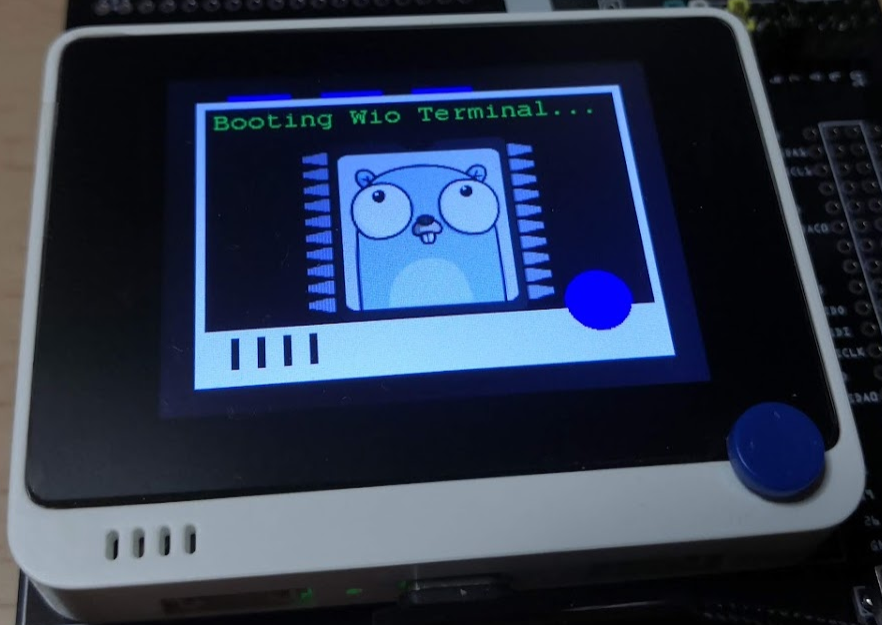

# ダウンロード

ダウンロードに時間がかかる可能性があるので、最初にダウンロードリンクを記載します。すぐにダウンロードを開始してください。明確にインストール済みである場合でも (実際には使用しないかもしれませんが) ダウンロードするようにしてください。
Go は Go 1.16 以降が入っていれば問題ありませんし、 Git はインストールされていればかなり古い Version でもおそらく問題ありません。しかし、もしものために説明を聞きつつダウンロードは進めてください。

## Windows 環境

以下の 3 ファイルをダウンロードしてください。

* [Git](https://gitforwindows.org/)
    * https://github.com/git-for-windows/git/releases/download/v2.33.1.windows.1/Git-2.33.1-64-bit.exe
    * Download をクリックして Git-2.33.1-64-bit.exe のようなファイルをダウンロード
* [Go](https://golang.org/dl/)
    * https://golang.org/dl/go1.17.3.windows-amd64.msi
    * 他 version の Go が入っている場合などは [zip 版](https://golang.org/dl/go1.17.3.windows-amd64.zip) を使っても良いですが、原則 msi 版を使ってください
* [TinyGo](https://tinygo.org/getting-started/install/windows/)
    * https://github.com/tinygo-org/tinygo/releases/download/v0.20.0/tinygo0.20.0.windows-amd64.zip

ハンズオンでは (WSL2 ではなく) Windows Native 版の Go および TinyGo を使用します。 Windows Native 環境に Git / Go などがインストールされていない場合はインストールが必要です。

## macOS 環境

以下の 2 ファイルをダウンロードしてください。

* [Go](https://golang.org/dl/)
    * https://golang.org/dl/go1.17.3.darwin-amd64.pkg
        * apple M1 chip の mac についても darwin/amd64 をインストールしてください
* [TinyGo](https://tinygo.org/getting-started/install/macos/)
    * https://github.com/tinygo-org/tinygo/releases/download/v0.20.0/tinygo0.20.0.darwin-amd64.tar.gz

## Linux 環境

以下の 2 ファイルをインストールしてください。
また Git がインストールされていない場合、後述の `apt install git` を実行してください。

* [Go](https://golang.org/dl/)
    * https://golang.org/dl/go1.17.3.linux-amd64.tar.gz
* [TinyGo](https://tinygo.org/getting-started/install/linux/)
    * https://github.com/tinygo-org/tinygo/releases/download/v0.20.0/tinygo_0.20.0_amd64.deb

Git がインストールされていない場合、以下を実行してください。

* Git
    * `sudo apt install git`


# 対象としている読者

以下を対象としています。
もちろん、すでに TinyGo + Wio Terminal で遊び倒している人でも問題ありません。

* Go を少し触ったことがある
* 組込マイコンで遊んだことがない
* TinyGo を使ったことがない
* Wio Terminal は今回が初めて

# TinyGo とは

マイコンや WASM などの Small Places 向けの Go Compiler です。
大雑把な理解としては Go の文法でマイコン開発や WASM 開発ができるもの、という程度の認識でよいです。

* [TinyGo - Go on Microcontrollers and WASM](https://tinygo.org/)


# Go と TinyGo の違い

基本的な構文は Go と同じですが、パソコンを前提として作られている Go とは異なり、より小さいリソースで動作するような割り切りがあります。
また、マイコンで使うためのいくつかのディレクティブが追加されています。

* 0.20.0 時点で goroutine は GOMAXPROCS = 1 時のときの動作に近い
    * 例えば `time.Sleep()` 等のブロックする命令が呼ばれない限り goroutine は切り替わらない
* runtime package などいくつかの標準 package は TinyGo 側のものが使われる
    * 一方で fmt や encoding などは Go のものが使われる
* マイコンやターゲットボード向けの標準 package が追加されている
    * マイコンやボード毎の差異を吸収するための machine package や runtime package など
    * volatile アクセスのための runtime/volatile package
* reflect package が完全ではない
    * これにより、よく話題にあがる encoding/json が動かない、などが発生している
* 未使用変数や未使用関数等は最適化により削除される

# 必要な環境

このハンズオンでは PC と Wio Terminal 以外の外付けの部品は使用しません。
必要なのは TinyGo が動く PC と Wio Terminal のみです。

* 機材
    * PC (Windows / macOS / Linux のいずれか)
        * 詳しくはオフィシャルページの [Getting Started / Quick install](https://tinygo.org/getting-started/install/) を参照
        * 手元で Windows 10 および Ubuntu 20.04 の環境は試しています
    * Wio Terminal
        * 公式: https://www.seeedstudio.com/Wio-Terminal-p-4509.html
        * 例えば以下から購入できます
            * https://akizukidenshi.com/catalog/g/gM-15275/
            * https://www.switch-science.com/catalog/6360/
            * https://www.marutsu.co.jp/pc/i/1633550/
            * https://www.amazon.co.jp/studio-MicroPython-Raspberry-ATSAMD51%E3%83%99%E3%83%BC%E3%82%B9-%E3%83%87%E3%83%A5%E3%82%A2%E3%83%AB%E3%83%90%E3%83%B3%E3%83%89WiFi/dp/B08CHBV88D
* ソフトウェア
    * [Getting Started / Quick install](https://tinygo.org/getting-started/install/) に従い以下をインストールする
        * Go 1.17
            * goenv 等は使用しないほうが環境立ち上げで失敗しにくい
        * TinyGo 0.20.0
    * 上記以外
        * Git
        * シリアル通信ソフト
            * このハンズオンでは、このハンズオン用に作成した `github.com/sago35/yterm` を使います
            * 例) Windows : [Tera Term](https://ttssh2.osdn.jp/) など
            * 例) macOS / Linux : [Minicom](https://salsa.debian.org/minicom-team/minicom) や [GNU Screen](https://www.gnu.org/software/screen/) など


# Wio Terminal とは

Wio Terminal は Seeed 社のディスプレイ付きの開発ボードです。320 x 240 のディスプレイ、 WiFi / BLE 搭載、ボタンに加速度センサに MicroSD カードスロットに、と非常に多機能です。

マイコンは Microchip 社の ATSAMD51P19 (Arm Cortex-M4 120MHz) が搭載されています。

公式 : https://www.seeedstudio.com/Wio-Terminal-p-4509.html
日本語 wiki : https://wiki.seeedstudio.com/jp/Wio-Terminal-Getting-Started/
英語 wiki : https://wiki.seeedstudio.com/Wio-Terminal-Getting-Started/

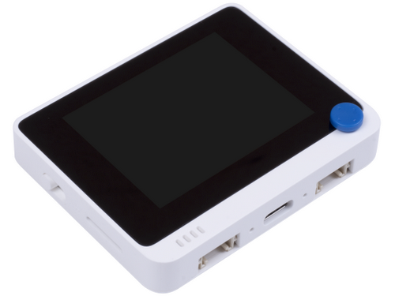

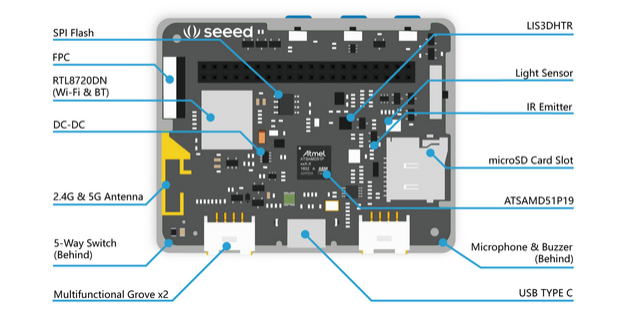

※画像は [公式サイト](https://www.seeedstudio.com/Wio-Terminal-p-4509.html) より

# 環境設定／インストール

## Windows

### Git

以下からダウンロードしてインストールしてください。

* https://gitforwindows.org/
    * https://github.com/git-for-windows/git/releases/download/v2.33.1.windows.1/Git-2.33.1-64-bit.exe


インストールしたら、以下を実行してインストールできていることを確認してください。

```
$ git version
git version 2.33.1.windows.1
```

### Go

以下からダウンロードしてインストールしてください。

* https://golang.org/dl/
    * https://golang.org/dl/go1.17.3.windows-amd64.msi


インストールしたら、以下を実行してインストールできていることを確認してください。

```
$ go version
go version go1.17.3 windows/amd64
```

### TinyGo

以下をダウンロードして生成される `tinygo` フォルダを `C:\tinygo` となるように解凍／コピーしてください。最終的に `C:\tinygo\bin\tinygo.exe` に `tinygo.exe` が存在すればよいです。

* https://tinygo.org/getting-started/install/windows/
    * https://github.com/tinygo-org/tinygo/releases/download/v0.20.0/tinygo0.20.0.windows-amd64.zip

環境変数 PATH を通しておきます。このハンズオンでは cmd.exe もしくは Git に含まれる bash.exe を使用してください。

```
# cmd.exe を使う場合
$ set PATH=C:\tinygo\bin;%PATH

# Git に含まれる bash.exe を使う場合
$ export PATH=/C/tinygo/bin:$PATH
```

インストールしたら、以下を実行してインストールできていることを確認してください。

```
$ tinygo version
tinygo version 0.20.0 windows/amd64 (using go version go1.17 and LLVM version 11.0.0)
```


### yterm

以下を実行してください。
Windows / macOS / Linux のそれぞれで実行可能です。

```
$ go install github.com/sago35/yterm@latest
```

インストールしたら、以下を実行してインストールできていることを確認してください。

```
$ yterm --help
(略)
```

## macOS

### Git

macOS の人はもしインストールされていない場合は以下でインストールしてください。

* `brew install git`
    * https://qiita.com/suke_masa/items/4bed855628f7414293f8

```
$ git version
git version 2.33.1
```

### Go

以下からダウンロードしてインストールしてください。

* https://golang.org/dl/
    * intel chip : https://golang.org/dl/go1.17.3.darwin-amd64.pkg
    * apple m1 chip : https://golang.org/dl/go1.17.3.darwin-arm64.pkg

```
$ go version
go version go1.17.3
```

### TinyGo

以下をダウンロードして生成される `tinygo` フォルダを `~/tinygo` に解凍／コピーしてください。最終的に `~/tinygo/bin/tinygo` に `tinygo` の実行体が存在すればよいです。

* https://tinygo.org/getting-started/install/macos/
    * https://github.com/tinygo-org/tinygo/releases/download/v0.20.0/tinygo0.20.0.darwin-amd64.tar.gz

環境変数 PATH を通しておきます。

```
$ export PATH=~/tinygo/bin:$PATH
```

インストールしたら、以下を実行してインストールできていることを確認してください。

```
$ tinygo version
tinygo version 0.20.0 darwin/amd64 (using go version go1.17 and LLVM version 11.0.0)
```

### yterm

以下を実行してください。
Windows / macOS / Linux のそれぞれで実行可能です。

```
$ go install github.com/sago35/yterm@latest
```

インストールしたら、以下を実行してインストールできていることを確認してください。

```
$ yterm --help
(略)
```

## Linux

### Git

以下でインストールしてください。

* `sudo apt install git`

Git をインストールしたら、以下を実行してインストールできていることを確認してください。

```
$ git version
git version 2.33.1
```

### Go

以下からダウンロードしてインストールしてください。

* https://golang.org/dl/
    * https://golang.org/dl/go1.17.3.linux-amd64.tar.gz

インストール方法は以下に記載されています。

    * https://golang.org/doc/install

Go をインストールしたら、以下を実行してインストールできていることを確認してください。

```
$ go version
go version go1.17.3
```

### TinyGo

以下をダウンロードして、後述の dpkg でインストールしてください。

* https://tinygo.org/getting-started/install/linux/
    * https://github.com/tinygo-org/tinygo/releases/download/v0.20.0/tinygo_0.20.0_amd64.deb

```
$ sudo dpkg -i tinygo_0.20.0_amd64.deb
```

環境変数 PATH を通しておきます。

```
$ export PATH=$PATH:/usr/local/tinygo/bin
```

インストールしたら、以下を実行してインストールできていることを確認してください。

```
$ tinygo version
tinygo version 0.20.0 linux/amd64 (using go version go1.17 and LLVM version 11.0.0)
```

### yterm

以下を実行してください。
Windows / macOS / Linux のそれぞれで実行可能です。

```
$ go install github.com/sago35/yterm@latest
```

インストールしたら、以下を実行してインストールできていることを確認してください。

```
$ yterm --help
(略)
```

## TinyGo のインストール確認1 (build)

以下のコマンドで、正常にビルドが出来ることを確認してください。以下のように何らかの情報が表示されれば、 TinyGo のインストールは正常にできていて、少なくとも Wio Terminal の開発は可能となります。他のボード／マイコンについては別途追加インストールが必要になる場合があります。

```
$ tinygo build -o blinky.uf2 --target wioterminal --size short examples/blinky1
   code    data     bss |   flash     ram
   8172      36    6340 |    8208    6376
```

## TinyGo のインストール確認2 (手動でのマイコン書き換え)

上記で `blinky.uf2` を作った場合は以下の方法で書き込むことができます。
docker を使っている場合は、このやり方がシンプルな書き込み方法になります。

* ブートローダーに遷移させる
    * 素早くリセットを 2 回実行します (参考: [Wio TerminalのUSB書き込みエラーの回復方法](https://qiita.com/carcon999/items/ec8045adc1309b2e5361))
        * うまく遷移出来た場合、下記画像の青色 LED がやさしく光ります
        * また、この時 OS からはマスストレージデバイスとして認識されます
* マスストレージデバイスとして OS から認識されるので、 uf2 をルートドライブにコピーする
    * Windows の場合は例えば `cmd.exe` から `copy blinky.uf2 D:` 等で書き込みできます

書き込みが完了したら、 USB 端子付近の青色 LED が 1 秒周期で点滅します。この時マスストレージデバイスのマウントが解除されますが、正常な動作です。

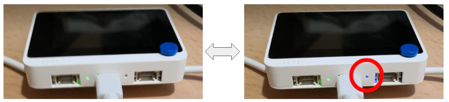

> tips: マスストレージデバイスとして認識されない場合
> セキュリティソフト／ポリシーなどによりマスストレージデバイス (※) のマウントを禁止している場合があります。この場合はハンズオンを継続することができません。
> ※ USB フラッシュメモリ等

## TinyGo のインストール確認3 (tinygo flash による書き換え)

以下のコマンドを実行することで、ビルドしつつ書き換えすることができます。基本的にはこのやり方を使って開発のサイクルを回していきます。書き換えに成功したことが分かるように、先ほどとは違うものを書き込んでみましょう。

```
$ tinygo flash --target wioterminal --size short examples/button
   code    data     bss |   flash     ram
   8204      36    6340 |    8240    6376
```

`examples/button` は、 `machine.BUTTON` (別名: `machine.WIO_KEY_A`) が押された時だけ LED を点灯します。
`WIO_KEY_A` は Wio Terminal の上部に 3 つあるボタンの一番右 (内側) のボタンです。

> tips: examples の場所
> TinyGo をインストールした場所の `src/examples` 以下に色々な例があります。> もしくは、 [github.com/tinygo-org/tinygo/tree/release/src/examples](https://github.com/tinygo-org/tinygo/tree/release/src/examples) からもダウンロードできます。 すべてが Wio Terminal で実行できるわけではないことに注意が必要です。 Wio Terminal で動く形でまとめたものは以下にありますので適宜参照してください
>
> * [Wio Terminal の周辺デバイスを使用する](https://qiita.com/sago35/items/92b22e8cbbf99d0cd3ef#wio-terminal-%E3%81%AE%E5%91%A8%E8%BE%BA%E3%83%87%E3%83%90%E3%82%A4%E3%82%B9%E3%82%92%E4%BD%BF%E7%94%A8%E3%81%99%E3%82%8B)

### tinygo flash が失敗する場合

panic してしまうような実行体をマイコンに書き込んだ場合などは、 tinygo flash が失敗します。
この場合は、手動でブートローダーモードに入れてから `tinygo flash` を使ってください。

参考: [COM ポートが見つからない場合](https://qiita.com/sago35/items/92b22e8cbbf99d0cd3ef#com-%E3%83%9D%E3%83%BC%E3%83%88%E3%81%8C%E8%A6%8B%E3%81%A4%E3%81%8B%E3%82%89%E3%81%AA%E3%81%84%E5%A0%B4%E5%90%88)


# L チカから始める開発の進め方

`hello world` の組込み版といえば `L チカ` といって LED を点滅させるプログラムになります。
ここでは、 `L チカ` を動作させてから、少しずつコードを改造していきます。

> Tips:
> TinyGo ではターゲットボード (`-target` オプションで指定するもの) 毎の差異を `machine` パッケージである程度吸収しています。ボード上に LED が存在する場合は、ほとんどの場合 `machine.LED` という名前で定義されています。
> 例えば wioterminal の定義は以下にあります。
>
> * https://github.com/tinygo-org/tinygo/blob/release/src/machine/board_wioterminal.go

## プロジェクトを開始する

新しい場所に workshop という名前のフォルダを作成してください。
その後 `go mod init` を実行してください。

```
$ cd (任意の場所)

$ mkdir workshop

$ cd workshop

$ go mod init workshop
```

その後、 `./01_blinky` というフォルダを作り `./01_blinky/main.go` というファイルを以下の内容で作成してください。

[./01_blinky/main.go](./01_blinky/main.go)  
```go:./01_blinky/main.go
package main

import (
	"machine"
	"time"
)

func main() {
	led := machine.LED
	//led := machine.LCD_BACKLIGHT
	led.Configure(machine.PinConfig{Mode: machine.PinOutput})
	for {
		led.Low()
		time.Sleep(time.Millisecond * 500)

		led.High()
		time.Sleep(time.Millisecond * 500)
	}
}
```

以下で書き込むことができます。

```
$ tinygo flash --target wioterminal --size short ./01_blinky/
   code    data     bss |   flash     ram
   7756      36    6340 |    7792    6376
```

うまく書き込みが出来たら、上記ソース内の `led` の定義を `machine.LED` から `machine.LCD_BACKLIGHT` に切り替えてみたり、 `time.Sleep` の待ち時間を変更して周期を変えてみましょう。
ソース変更 → `tinygo flash` → 確認というのが、基本的な開発サイクルになります。

> tips: tinygo flash や tinygo build 時の package 指定方法
> go build と同じで、現在フォルダの package を build / flash する場合は省略もしくは `.` で指定できます。例えば一つフォルダが深い場合は `./01_blinky` のような指定が必要ですが、同じ階層であれば `.` と書くか省略することができます。単一ファイルから構成されるソースをビルドする場合は、 `./01_blinky/main.go` のような指定もできます

## LSP / gopls 対応

TinyGo は、 machine package などを GOROOT に配置しているため設定を行うまでは gopls 等でエラーが表示され machine.LED の定義元へのジャンプ等が出来ません。 TinyGo は machine package など (Go を良く知っていても) 慣れていない package 構成であったり、 build-tag による分岐などが多いため LSP の設定をしておいた方が無難です。

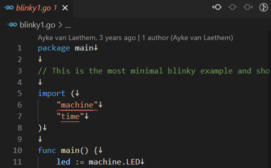

公式ドキュメントは以下にあります。

* https://tinygo.org/docs/guides/ide-integration/

日本語の情報としては以下に記載しています。

* [TinyGo + 'VSCode or Vim (もしくはそれ以外の LSP 対応エディタ)' で gopls 連携する方法](https://qiita.com/sago35/items/c30cbce4a0a3e12d899c)
* [TinyGo + Vim で gopls するための設定](https://qiita.com/sago35/items/f0b058ed5c32b6446834)

## 基本的な printf debug の方法

デバッグ方法が分からないと次のステップに進みにくいです。
組込み環境のデバッグ方法にもいろいろありますが、ここでは `printf debug` を用いた方法を学びます。

> tips: メリットデメリット
> このやり方は外部にデバッグ用のハードが不要なのが良いところです。一方で、 panic してしまうようなソースコードに対しては確認が困難です。そのような場合は Wio Terminal の外側に専用のデバッガを追加する形で対応しますが、ここでは扱いません。

### println と fmt.Print

TinyGo では `println` や `fmt.Print` 等で出力される先は USB-CDC or UART となっていて、 Wio Terminal は USB-CDC を使うように初期設定されています。シリアル通信ソフトを用いてマイコンからの出力を PC で受け取ったり、 PC からの出力をマイコンで受け取ったりすることができます。
ここでは、 `printf debug` に必要なマイコン側から PC に出力するためのソースコードを紹介します。
先ほどのコードに `cnt` 変数を追加しつつ `fmt.Printf()` で値を確認してみましょう。
※追加した行には、 `// ← 追加` というコメントを記載しています

[./01_blinky/main.go](./01_blinky/main.go)  
```go:./01_blinky/main.go
package main

import (
	"fmt" // ← 追加
	"machine"
	"time"
)

func main() {
	led := machine.LED
	//led := machine.LCD_BACKLIGHT
	led.Configure(machine.PinConfig{Mode: machine.PinOutput})
	cnt := 0 // ← 追加
	for {
		cnt++                         // ← 追加
		fmt.Printf("cnt %d\r\n", cnt) // ← 追加
		led.Low()
		time.Sleep(time.Millisecond * 500)

		led.High()
		time.Sleep(time.Millisecond * 500)
	}
}
```

> tips: シリアル通信の改行コード
> シリアル通信は基本的には LF でもよいですが CRLF にしたほうが無難です。 `println()` で CRLF にする場合は面倒ですが `println("hello", "\r")` のようにすることができます。

シリアルポートを開くと以下のように 1 秒毎に 1 行表示されると思います。例えば wioterminal に接続する場合は以下のように実行します。もし、うまく接続できない場合は後述のポート名を指定するやり方を試してください。シリアルポートのモニターが不要となった時は、 Ctrl-C で閉じてください。

```
$ yterm --target wioterminal
...
cnt : 6
cnt : 7
cnt : 8
cnt : 9
cnt : 10
...
```

うまくいかない場合は、シリアルポートとして認識されているか、マイコンは動いているか、を確認してください。マイコンが動いているかどうかは、例えば LED 点灯状態により確認できます。上記のソースコードのように `L チカ` のようなコードを埋め込むと良いです。


> tips: TinyGo の main() 関数は終了しないようにする
> main() 関数を抜けた場合、プログラムは完全に停止します。この状態では `tinygo flash` に失敗するなどあまり良くない状態となります。なので、基本的には `for { time.Sleep(time.Hour) }` などで `main()` 関数を抜けないようにするのが TinyGo 流となります。

### ポートを指定して yterm で接続する

Wio Terminal が複数接続されている場合等はポートを指定して yterm に接続する必要があるかもしれません。まずはポート名を調べるために、 `yterm list` を実行します。

```
$ yterm list
COM8 2886 002D wioterminal
```

上記の場合は COM8 に wioterminal が存在するため以下を実行します。

```
$ yterm --port COM8
```

Windows の場合は `COM8` のような名前ですが他の OS では `/dev/cu.usb1` や `/dev/ttyACM1` のような名前でポートを指定できます。

> tips: なぜ yterm を使うか
Windows だと、ポートを開放しないとマイコン書き換え (`tinygo flash`) に失敗するため、説明することが増えるし、 OS 毎の説明を書くと複雑になるため。慣れている人は好きなソフトを使ってください。

### Windows OS での注意点

Windows では何らかのソフトがシリアルポートを開いている時は、他のソフトはアクセスできません。
yterm や Tera Term 等で接続しているときに `tinygo flash` しようとすると以下のようなエラーとなります。
通信ソフトを閉じるか、ブートローダーに遷移させてください。

```
$ tinygo flash --target wioterminal --size short ./01_blinky/main.go
   code    data     bss |   flash     ram
  47632    1384    6340 |   49016    7724
error: failed to reset port %TEMP%\tinygo914402091\main.uf2: opening port: Serial port busy
```

## 外部 package を使用する1 (例を実行する)

Go と基本的には同じで `import` に外部 package を追加した上で `go get` が必要になります。ここでは `tinygo.org/x/drivers/examples/ili9341/pyportal_boing` を動かす過程で `go get` を使います。以下を実行すると `go get` を促されます。

```
$ tinygo flash --target wioterminal --size short tinygo.org/x/drivers/examples/ili9341/pyportal_boing
no required module provides package tinygo.org/x/drivers/examples/ili9341/pyportal_boing; to add it:
        go get tinygo.org/x/drivers/examples/ili9341/pyportal_boing
```

しかし、指示通りに `go get` してもうまく行く場合もありますが、失敗する場合もあります。
失敗時はエラーメッセージが表示の通り TinyGo のみに存在する標準 package を見つけることができずエラーになります。

```
$ go get tinygo.org/x/drivers/examples/ili9341/pyportal_boing
tinygo.org/x/drivers/examples/ili9341/pyportal_boing imports
        machine: package machine is not in GOROOT (c:\go\src\machine)
```

この場合は以下のように実施してください。

```
$ go get tinygo.org/x/drivers
go get: added tinygo.org/x/drivers v0.17.1
```

これで実行できるようになりました。

```
$ tinygo flash --target wioterminal --size short tinygo.org/x/drivers/examples/ili9341/pyportal_boing
   code    data     bss |   flash     ram
  30312      72   37496 |   30384   37568
```

この状態で `tinygo.org/x/drivers` への依存が `go.mod` に書き込まれているため、 `tinygo.org/x/drivers` 以下の package を使用することが出来るようになります。

```:go.mod
module workshop

go 1.17

require tinygo.org/x/drivers v0.17.1 // indirect
```

## 外部パッケージを使用する2 (ブザーを鳴らす)

Wio Terminal にはブザーが搭載されています。
搭載されているブザーは High / Low の周期で音を制御することができます。
例えば周期として 440Hz で High / Low を変化させることで[ラの音 (A4)](https://ja.wikipedia.org/wiki/A440) を鳴らすことができます。

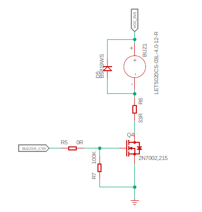

> tips: 回路図を確認する
> 組込みにおいて各種センサー等がどこにどのように繋がっているかを確認しておく必要があります。 Wio Terminal の場合は以下にまとまっているので確認しておくと良いです。上記の図は、下記 pdf からの抜粋になります。
> https://wiki.seeedstudio.com/Wio-Terminal-Getting-Started/
> https://files.seeedstudio.com/wiki/Wio-Terminal/res/Wio-Terminal-SCH-v1.2.pdf

ブザーは tinygo.org/x/drivers/buzzer を使って動作させることができます。
上記で `go get tinygo.org/x/drivers` を実行している場合はそのまま動きます。
`tinygo.org/x/drivers/buzzer` は現状 time.Sleep() を用いた周波数制御であまり精度が良くないため綺麗な音は鳴らないのですが、 main.go を以下のように書き換えることで最低限の動作をさせることができます。
変更箇所は `// ↓ 追加` と `// ↑ 追加` の間、もしくは `// ← 追加` が書かれた行となります。

[./01_blinky/main.go](./01_blinky/main.go)  
```go:./01_blinky/main.go
package main

import (
	"fmt"
	"machine"
	"time"

	"tinygo.org/x/drivers/buzzer" // ← 追加
)

// ↓ 追加
type note struct {
	tone     float64
	duration float64
}
// ↑ 追加

func main() {
	led := machine.LED
	//led := machine.LCD_BACKLIGHT
	led.Configure(machine.PinConfig{Mode: machine.PinOutput})
	cnt := 0

	// ↓ 追加
	bzrPin := machine.WIO_BUZZER
	bzrPin.Configure(machine.PinConfig{Mode: machine.PinOutput})
	bzr := buzzer.New(bzrPin)

	notes := []note{
		{buzzer.C3, buzzer.Quarter},
		{buzzer.D3, buzzer.Quarter},
		{buzzer.E3, buzzer.Quarter},
	}
	// ↑ 追加

	for {
		cnt++
		fmt.Printf("cnt %d\r\n", cnt)
		led.Low()
		time.Sleep(time.Millisecond * 500)

		led.High()
		time.Sleep(time.Millisecond * 500)

		// ↓ 追加
		for _, n := range notes {
			bzr.Tone(n.tone, n.duration)
			time.Sleep(10 * time.Millisecond)
		}
		// ↑ 追加
	}
}
```

# ハンズオン

残りの時間で以下を実行してみましょう。すべてを実行するには時間が足りないと思うので、好きなものからチャレンジしてみてください。

`USB-CDC 送受信` と `SPI / ILI9341 ディスプレイ` あたりを実行すると楽しみやすいと思います。

困った時は以下の記事も参考になると思います。

* [Wio Terminal の周辺デバイスを使用する](https://qiita.com/sago35/items/92b22e8cbbf99d0cd3ef#wio-terminal-%E3%81%AE%E5%91%A8%E8%BE%BA%E3%83%87%E3%83%90%E3%82%A4%E3%82%B9%E3%82%92%E4%BD%BF%E7%94%A8%E3%81%99%E3%82%8B)

## GPIO

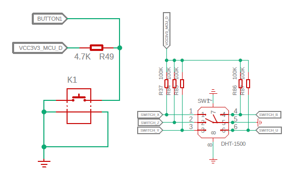


GPIO は machine.Pin を入力 (machine.PinInput 等) に設定することで入力端子として使用することができます。あるいは既に登場している LED のように machine.PinOutput に設定することで出力端子として使用することができます。実際には以下のようなコードになります。

```go
// ボタン A (WIO_KEY_A) を入力モードで初期化
machine.WIO_KEY_A.Configure(machine.PinConfig{Mode: machine.PinInputPullup})

// 現在の状態 (High / Low) を取得
status := machine.WIO_KEY_A.Get()
```

```go
// 液晶 (LCD_BACKLIGHT) を出力モードで初期化
machine.LCD_BACKLIGHT.Configure(machine.PinConfig{Mode: machine.PinOutput})

// 出力を変化させる
machine.LCD_BACKLIGHT.High()
machine.LCD_BACKLIGHT.Low()
machine.LCD_BACKLIGHT.Toggle()
```

* https://tinygo.org/docs/reference/microcontrollers/machine/wioterminal/#type-pin
* https://github.com/tinygo-org/tinygo/blob/v0.20.0/src/machine/machine_atsamd51.go#L23-L48

ここでは、 Wio Terminal に存在する以下のボタン／キーに対応するアプリケーションを作成します。

* `WIO_KEY_A` ～ `WIO_KEY_B` が押されたら液晶を On にしつつシリアルにボタン名を出力
* 十字キーの上下左右 (`WIO_5S_*`) が押されたら液晶を On にしつつシリアルにキー名を出力
* 十字キー自身が押された (`WIO_5S_PRESS`) ら液晶を On にしつつシリアルにキー名を出力

[./02_gpio/main.go](./02_gpio/main.go)  
```go:./02_gpio/main.go
package main

import (
	"fmt"
	"machine"
	"time"
)

const (
	led = machine.LCD_BACKLIGHT
)

func main() {
	led.Configure(machine.PinConfig{Mode: machine.PinOutput})

	machine.WIO_KEY_A.Configure(machine.PinConfig{Mode: machine.PinInputPullup})
	machine.WIO_KEY_B.Configure(machine.PinConfig{Mode: machine.PinInputPullup})
	machine.WIO_KEY_C.Configure(machine.PinConfig{Mode: machine.PinInputPullup})

	machine.WIO_5S_UP.Configure(machine.PinConfig{Mode: machine.PinInputPullup})
	machine.WIO_5S_LEFT.Configure(machine.PinConfig{Mode: machine.PinInputPullup})
	machine.WIO_5S_RIGHT.Configure(machine.PinConfig{Mode: machine.PinInputPullup})
	machine.WIO_5S_DOWN.Configure(machine.PinConfig{Mode: machine.PinInputPullup})
	machine.WIO_5S_PRESS.Configure(machine.PinConfig{Mode: machine.PinInputPullup})

	for {
		if !machine.WIO_KEY_A.Get() {
			led.Low()
			fmt.Printf("machine.WIO_KEY_A pressed\r\n")
		} else if !machine.WIO_KEY_B.Get() {
			led.Low()
			fmt.Printf("machine.WIO_KEY_B pressed\r\n")
		} else if !machine.WIO_KEY_C.Get() {
			led.Low()
			fmt.Printf("machine.WIO_KEY_C pressed\r\n")
		} else if !machine.WIO_5S_UP.Get() {
			led.Low()
			fmt.Printf("machine.WIO_5S_UP pressed\r\n")
		} else if !machine.WIO_5S_LEFT.Get() {
			led.Low()
			fmt.Printf("machine.WIO_5S_LEFT pressed\r\n")
		} else if !machine.WIO_5S_RIGHT.Get() {
			led.Low()
			fmt.Printf("machine.WIO_5S_RIGHT pressed\r\n")
		} else if !machine.WIO_5S_DOWN.Get() {
			led.Low()
			fmt.Printf("machine.WIO_5S_DOWN pressed\r\n")
		} else if !machine.WIO_5S_PRESS.Get() {
			led.Low()
			fmt.Printf("machine.WIO_5S_PRESS pressed\r\n")
		} else {
			led.High()
		}

		time.Sleep(time.Millisecond * 10)
	}
}
```

> tips: ボタンが押されている時の電圧は回路によって決まる
> ボタンを押している時に High で離した時に Low になる場合と、その逆になる場合の両方のパターンがあります。これは回路によって決まります。 Wio Terminal はすべてのボタンが Pull-Up されていて離している時は High になっています。

## USB-CDC 送受信

上記の printf debug にて USB-CDC 経由で Wio Terminal からのデータを PC で受け取ることが出来ました。ここでは PC から Wio Terminal にデータを送って操作してみましょう。

題材は以下とします。

* 仕様
    * シリアルから `on\n` と入力すると液晶を ON にする
    * シリアルから `off\n` と入力すると液晶を OFF にする
    * シリアルから `toggle\n` もしくは `t\n` と入力すると液晶の ON と OFF を切り返る

`println` や `fmt.Printf` を実行した場合、 Go だと `os.Stdout` に出力されますが、 TinyGo の場合は `machine.Serial` に出力されます。Wio Terminal の `machine.Serial` のデフォルト値は `*machine.USBCDC` 型なので USBCDC への出力となります。
では入力はどうすればよいか。 `*machine.USBCDC` が `io.Reader` インターフェースを持つため普通に読み書きそうなのですが goroutine スイッチの兼ね合いにより TinyGo 0.20.0 時点では bufio.Scanner 等ではうまく動かないので以下のように書く必要があります。

下記は `usbcdc.Buffered()` で Wio Terminal が受信したデータがあるかどうかを調べ、データがある場合のみ `usbcdc.ReadByte()` しています。このように書くことで、単に echo するだけのサーバーが出来上がります。

[./03_usbcdc/main.go](./03_usbcdc/main.go)  
```go:./03_usbcdc/main.go
package main

import (
	"machine"
)

func main() {
	usbcdc := machine.Serial

	for {
		if usbcdc.Buffered() > 0 {
			data, _ := usbcdc.ReadByte()

			// just echo the character
			usbcdc.WriteByte(data)
		}
	}
}
```

あとは USBCDC 経由で `on\r\n` もしくは `on\n` と入力された場合等に所定のコマンド等を実行するようにします。改行文字が入力されるまでは buffer していくようにするとうまく処理できます。

完成形は以下になります。

[./03_usbcdc/main.go](./03_usbcdc/main.go)  
```go:./03_usbcdc/main.go
package main

import (
	"machine"
	"time"
)

func main() {
	led := machine.LCD_BACKLIGHT
	led.Configure(machine.PinConfig{Mode: machine.PinOutput})
	led.High()

	usbcdc := machine.Serial
	usbcdc.Configure(machine.UARTConfig{})

	input := make([]byte, 64)
	i := 0
	for {
		if usbcdc.Buffered() > 0 {
			data, _ := usbcdc.ReadByte()

			switch data {
			case 13:
				// return key
				usbcdc.Write([]byte("\r\n"))

				switch string(input[:i]) {
				case "on":
					led.High()
				case "off":
					led.Low()
				case "toggle", "t":
					led.Toggle()
				}
				i = 0
			default:
				// just echo the character
				usbcdc.WriteByte(data)
				input[i] = data
				i++
			}
		}
		time.Sleep(10 * time.Millisecond)
	}
}
```

## タイマー割込み

TinyGo では `time.Sleep()` や `time.Tick()` を用いてある程度の精度での周期処理等を実現できます。が、正確に刻みたい場合は systick を使うと良いです。以下は examples/systick と同じです。使うときは channel  と組み合わせると良いです。

* https://github.com/tinygo-org/tinygo/blob/release/src/examples/systick/systick.go

[./04_systick/main.go](./04_systick/main.go)  
```go:./04_systick/main.go
package main

import (
	"device/arm"
	"machine"
)

var timerCh = make(chan struct{}, 1)

func main() {
	machine.LED.Configure(machine.PinConfig{Mode: machine.PinOutput})

	// timer fires 10 times per second
	arm.SetupSystemTimer(machine.CPUFrequency() / 10)

	for {
		machine.LED.Low()
		<-timerCh
		machine.LED.High()
		<-timerCh
	}
}

//export SysTick_Handler
func timer_isr() {
	select {
	case timerCh <- struct{}{}:
	default:
		// The consumer is running behind.
	}
}
```

## PWM / ブザー


ここでは、 buzzer package を使ってドレミの歌を作ってみましょう。以下の buzzer package を使って音の高さと長さを処理することができます。

* https://pkg.go.dev/tinygo.org/x/drivers@v0.17.1/buzzer

完成版 (と言っても最初のフレーズのみですが) は以下。

[./05_buzzer/main.go](./05_buzzer/main.go)  
```go:./05_buzzer/main.go
package main

import (
	"machine"
	"time"

	"tinygo.org/x/drivers/buzzer"
)

type note struct {
	tone     float64
	duration float64
}

func main() {
	bzrPin := machine.WIO_BUZZER
	bzrPin.Configure(machine.PinConfig{Mode: machine.PinOutput})
	bzr := buzzer.New(bzrPin)

	notes := []note{
		{buzzer.C3, buzzer.Quarter},
		{buzzer.Rest, buzzer.Eighth},
		{buzzer.D3, buzzer.Eighth},
		{buzzer.E3, buzzer.Quarter},
		{buzzer.Rest, buzzer.Eighth},
		{buzzer.C3, buzzer.Eighth},
		{buzzer.E3, buzzer.Quarter},
		{buzzer.C3, buzzer.Quarter},
		{buzzer.E3, buzzer.Half},
	}

	for _, n := range notes {
		bzr.Tone(n.tone, n.duration)
		time.Sleep(10 * time.Millisecond)
	}

	for {
		time.Sleep(time.Hour)
	}
}
```

> tips: buzzer の音が綺麗に鳴らない
> 綺麗な音を鳴らすには buzzer に対してある程度正確に ON / OFF 信号を与える必要があります。現時点の buzzer package はソフトウェアで時間を計算しているためあまり正確ではありません。いずれこの部分はハードウェア PWM 機能を使うことで改善していくはずです。

## ADC / 光センサー

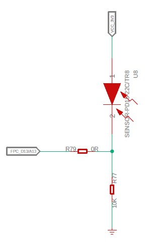

Wio Terminal には本体背面の透明窓の中に光センサーが搭載されています。この光センサーは光の強さを電圧に変換する動きであるため、 Wio Terminal からは電圧を読むと光の強さを知ることができます。光が強い時は 0xFFFF に近い値となり、光が弱いときは 0x0000 に近い値となります。光センサーは `machine.WIO_LIGHT` という名前でアクセスできます。

AD 値の読み取りを行う場合は、以下のように設定した上で使う必要があります。 TinyGo の ADC 初期設定は 12bit ADC で、左寄せとなっているため 0x0000 ～ 0xFFF0 の値を取ります。

```go
// machine.ADC 型の変数を作り、 Configure() をコールする
sensor := machine.ADC{Pin: machine.WIO_LIGHT}
sensor.Configure(machine.ADCConfig{})

// AD 値を読み取る
val := sensor.Get()
```

ここでは、光の強さに対応する電圧値 (0x0000 - 0xFFFF) をシリアルに出力しつつ、 0x8000 以上であれば led (液晶画面) を ON にするプログラムを作成します。

ADC については以下に記載があります。

* https://tinygo.org/docs/reference/microcontrollers/machine/wioterminal/#type-adc

[./06_light_sensor/main.go](./06_light_sensor/main.go)  
```go:./06_light_sensor/main.go
package main

import (
	"fmt"
	"machine"
	"time"
)

func main() {
	machine.InitADC()

	led := machine.LCD_BACKLIGHT
	led.Configure(machine.PinConfig{Mode: machine.PinOutput})

	sensor := machine.ADC{Pin: machine.WIO_LIGHT}
	sensor.Configure(machine.ADCConfig{})

	for {
		val := sensor.Get()
		fmt.Printf("%04X\r\n", val)
		if val < 0x8000 {
			led.Low()
		} else {
			led.High()
		}
		time.Sleep(time.Millisecond * 100)
	}
}
```

## I2C / 加速度センサー

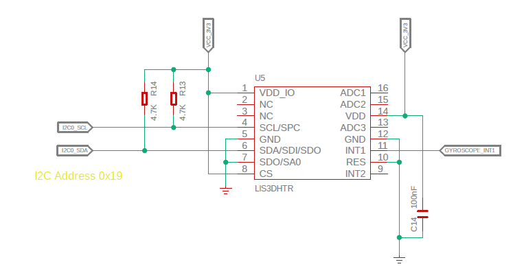

Wio Terminal には 3 軸加速度センサーである LIS3DH が搭載されています。 X / Y / Z 軸それぞれの加速度を読み取ることで傾き検知等が可能です。これは I2C 接続されているため、事前に I2C のセットアップが必要です。 I2C は回路図表記の `I2C0` ではなく `machine.I2C1` を使用します。

```go
machine.I2C1.Configure(machine.I2CConfig{SCL: machine.SCL1_PIN, SDA: machine.SDA1_PIN})
```

LIS3DH の driver は以下にあります。I2C で所定のコマンドを発行すると値を読み取ることが出来るため、とても簡単に使用することができます。

* https://pkg.go.dev/tinygo.org/x/drivers@v0.17.1/lis3dh

[./07_lis3dh/main.go](./07_lis3dh/main.go)  
```go:./07_lis3dh/main.go
package main

import (
	"machine"
	"time"

	"tinygo.org/x/drivers/lis3dh"
)

var i2c = machine.I2C1

func main() {
	i2c.Configure(machine.I2CConfig{SCL: machine.SCL1_PIN, SDA: machine.SDA1_PIN})

	accel := lis3dh.New(i2c)
	accel.Address = lis3dh.Address0 // address on the Wio Terminal
	accel.Configure()
	accel.SetRange(lis3dh.RANGE_2_G)

	println(accel.Connected())

	for {
		x, y, z, _ := accel.ReadAcceleration()
		println("X:", x, "Y:", y, "Z:", z)

		//rx, ry, rz := accel.ReadRawAcceleration()
		//println("X (raw):", rx, "Y (raw):", ry, "Z (raw):", rz)

		time.Sleep(time.Millisecond * 100)
	}
}
```


## SPI / ILI9341 ディスプレイ


画面を使った処理はパソコン上のプログラムとは異なる感動があると思います。 Wio Terminal には SPI 接続の ili9341 ディスプレイが搭載されています。解像度は 320x240 です。

所定の初期化を実施した後は、比較的簡単に扱うことができます。ここでは単純な図形を表示してみます。初期化は以下のように行います。
`InitDisplay()` では ili9341 に接続されている SPI3 / LCD_SCK_PIN / LCD_SDO_PIN / LCD_SDI_PIN / LCD_BACKLIGHTの初期化を行い `*ili9341.Device` を返しています。以降は `*ili9341.Device` を用いて画面に描画していきます。

```go
func InitDisplay() *ili9341.Device {
	machine.SPI3.Configure(machine.SPIConfig{
		SCK:       machine.LCD_SCK_PIN,
		SDO:       machine.LCD_SDO_PIN,
		SDI:       machine.LCD_SDI_PIN,
		Frequency: 48000000,
	})

	// configure backlight
	backlight := machine.LCD_BACKLIGHT
	backlight.Configure(machine.PinConfig{machine.PinOutput})

	display := ili9341.NewSPI(
		machine.SPI3,
		machine.LCD_DC,
		machine.LCD_SS_PIN,
		machine.LCD_RESET,
	)

	// configure display
	display.Configure(ili9341.Config{})

	backlight.High()

	display.SetRotation(ili9341.Rotation270)

	return display
}
```

`tinygo.org/x/drivers.Displayer` インターフェースは以下のように定義されていますので、基本的には `SetPixel()` で描画していくことになります。

```go
type Displayer interface {
	// Size returns the current size of the display.
	Size() (x, y int16)

	// SetPizel modifies the internal buffer.
	SetPixel(x, y int16, c color.RGBA)

	// Display sends the buffer (if any) to the screen.
	Display() error
}
```

しかし、 `SetPixel()` だけでは遅いし大変なので、多くの場合は `tinygo.org/x/tinydraw` や `tinygo.org/x/drivers/ili9341` の各種関数を用いて描画していきます。

* https://pkg.go.dev/tinygo.org/x/drivers@v0.17.1/ili9341
* https://pkg.go.dev/tinygo.org/x/tinydraw
* https://pkg.go.dev/tinygo.org/x/tinyfont

ということで、 tinydraw と tinyfont を `go get` しておきましょう。

```
$ go get tinygo.org/x/tinydraw
go get: added tinygo.org/x/tinydraw v0.0.0-20200416172542-c30d6d84353c

$ go get tinygo.org/x/tinyfont
```

ここでは以下のような画面を作っていきましょう。この画面は [基礎から学ぶ 組込みRust](https://www.c-r.com/book/detail/1403) で作成する題材の TinyGo 版になります。


画面の構成要素は以下の通りです。

* body : x=20 y=20 の位置から w=280 h=200 を白い四角で塗りつぶす (ili9341.Device.FillRectangle)
* lcd : x=25 y=25 の位置から w=270 h=160 を黒い四角で塗りつぶす (ili9341.Device.FillRectangle)
* speaker : x=40+i*15 y=190 の位置から w=5 h=20 を黒い四角で塗りつぶす (ili9341.Device.FillRectangle)
* buttons : x=40+i*60 y=40 の位置から w=40 h=5 を青い四角で塗りつぶす (ili9341.Device.FillRectangle)
* 5-way key : x=260 y=180 r=20 の青い円で塗りつぶす (tinydraw.FilledCircle)
* text : x=30 y=40 の位置にテキストを緑色で表示する (tinyfont.WriteLine)
* 中心に TinyGo のロゴ (60x51) を表示する (drivers.Displayer.SetPixel)

上記の画像は以下のようにして出力できます。なお、下記ソース内の `tinygo_logo_s_png` については、 png のデータから `const string` に変換したものを用意する必要があります。 github に置いているので各自コピーしてください。

[./08_spi_ili9341/main.go](./08_spi_ili9341/main.go)  
```go:./08_spi_ili9341/main.go
package main

import (
	"image/color"
	"image/png"
	"log"
	"machine"
	"strings"
	"time"

	"tinygo.org/x/drivers/ili9341"
	"tinygo.org/x/tinydraw"
	"tinygo.org/x/tinyfont"
	"tinygo.org/x/tinyfont/freemono"
)

var (
	white = color.RGBA{R: 0xFF, G: 0xFF, B: 0xFF, A: 0xFF}
	red   = color.RGBA{R: 0xFF, G: 0x00, B: 0x00, A: 0xFF}
	green = color.RGBA{R: 0x00, G: 0xFF, B: 0x00, A: 0xFF}
	blue  = color.RGBA{R: 0x00, G: 0x00, B: 0xFF, A: 0xFF}
	black = color.RGBA{R: 0x00, G: 0x00, B: 0x00, A: 0xFF}
)

func main() {
	display := InitDisplay()

	// body
	display.FillRectangle(20, 20, 280, 200, white)

	// lcd
	display.FillRectangle(25, 25, 270, 160, black)

	// speaker
	for i := int16(0); i < 4; i++ {
		display.FillRectangle(40+i*15, 190, 5, 20, black)
	}

	// buttons
	for i := int16(0); i < 3; i++ {
		display.FillRectangle(40+i*60, 15, 40, 5, blue)
	}

	// 5-way key
	tinydraw.FilledCircle(display, 260, 180, 20, blue)

	// text
	tinyfont.WriteLine(display, &freemono.Regular9pt7b, 30, 40, "Booting Wio Terminal...", green)

	// tinygo logo
	{
		img, err := png.Decode(strings.NewReader(tinygo_logo_s_png))
		if err != nil {
			log.Fatal(err)
		}

		w := img.Bounds().Dx()
		h := img.Bounds().Dy()
		for y := 0; y < h; y++ {
			for x := 0; x < w; x++ {
				r, g, b, _ := img.At(x, y).RGBA()
				display.SetPixel((320-int16(w))/2+int16(x), (240-int16(h))/2+int16(y), color.RGBA{R: uint8(r >> 8), G: uint8(g >> 8), B: uint8(b >> 8), A: 0xFF})
			}
		}
	}

	for {
		time.Sleep(time.Hour)
	}
}

func InitDisplay() *ili9341.Device {
	machine.SPI3.Configure(machine.SPIConfig{
		SCK:       machine.LCD_SCK_PIN,
		SDO:       machine.LCD_SDO_PIN,
		SDI:       machine.LCD_SDI_PIN,
		Frequency: 48000000,
	})

	// configure backlight
	backlight := machine.LCD_BACKLIGHT
	backlight.Configure(machine.PinConfig{machine.PinOutput})

	display := ili9341.NewSPI(
		machine.SPI3,
		machine.LCD_DC,
		machine.LCD_SS_PIN,
		machine.LCD_RESET,
	)

	// configure display
	display.Configure(ili9341.Config{})

	backlight.High()

	display.SetRotation(ili9341.Rotation270)
	display.FillScreen(color.RGBA{R: 0x00, G: 0x00, B: 0x00, A: 0xFF})

	return display
}
```

> tips: 画像表示について
> png 画像は小さいサイズであれば Go 標準の image/png を使うことができます。解像度が大きくなってくると RAM サイズの制限で描画できない事が多いです。例えば 320 x 240 サイズの `image.Image` 型に Decode された状態だと内部では `*image.RGBA` 型となり最低でも 320 x 240 x 4 = 76800 byte のメモリが必要となります。実際には計算途中のテンポラリ RAM などを含めると Wio Terminal が持つ 192KB の RAM では足りないことが多いです。
> このあたりを軽減するための package を `tinygo.org/x/drivers/image` に作っていますがまだ release されていません。

## WiFi

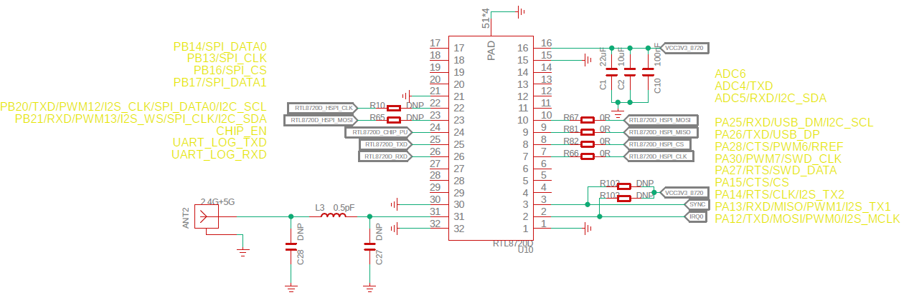

Wio Terminal には Realtek 社の RTL8720DN という WiFi / BLE に対応したチップが搭載されています。 TinyGo からもそのチップを使ってネットワークに接続したいですが、通常の Go の net/http package は大きすぎるため使用できません。そこで、機能制限がありますが TinyGo で使用できる Version を以下に作成しています。

* https://pkg.go.dev/tinygo.org/x/drivers@v0.17.1/rtl8720dn

RTL8720DN を使うためには、最初に firmware の Version Up が必要です。後述の手順に従い Version Up を実施してください。

WiFi の例はコードが非常に長くなるため省略しますが、以下のようにアクセスすることができます。基本的な機能 (`http.Get()` や `http.Post()` など) は Go の標準 package と同じように使うことができます。以下はまだ release branch には merge されていないため `go get tinygo.org/x/drivers@dev` を実行し dev branch を使用するように変更してください。

```go
res, err := http.Get(url)
res, err := http.Post(url, "application/json", body)

req, err := http.NewRequest(method, url, body)
res, err := http.Do(req)
```

cookie も扱うことができます。

```go
import "tinygo.org/x/drivers/net/http/cookiejar"

jar, err := cookiejar.New(nil)
if err != nil {
	return err
}
client := &http.Client{Jar: jar}
http.DefaultClient = client

res, err := http.Get(url)
```

`./09_webclient` には HTTP アクセスを行う例があります。 10 秒毎に 1 回 `http://tinygo.org` にアクセスして結果を返します。 ssid と password を変更することで、自身の WiFi アクセスポイントに接続してください。 2.4GHz でも 5GHz でも接続可能です。

`./10_webserver` は Wio Terminal を Web Server にしてブラウザ経由で操作することができます。以下のような画面で LED の ON / OFF などを試すことができます。 ssid と password を変更することを忘れずに。

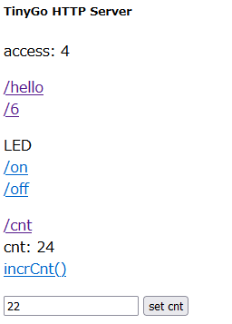

`/6` にアクセスすると以下のようにテトリスで遊ぶことができます。左右キーとスペースキーで操作できます。このテトリスは [たった464文字のテトロミノ落ち物パズル！創る力を拡大しよう、高専インカレ＆PCNサミットオンライン] (https://fukuno.jig.jp/3267) で紹介されていたものです。 Wio Terminal は実質的には js ファイルを serve しているだけでゲームには関わっていません。 (ゲーム自体は、アクセスした PC 側で処理されています)

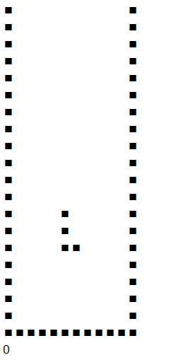

その他の例は以下にあるので色々と試してみてください。ソースコード内の ssid と password を設定するのを忘れずに。

* https://github.com/tinygo-org/drivers/tree/dev/examples/rtl8720dn

### RTL8720DN firmware の Version Up

以下に従い Version Up を行います。

* https://wiki.seeedstudio.com/Wio-Terminal-Network-Overview/

#### Windows

最低限のコマンドを記載します。これでうまくいかない場合は上記の Wiki に詳細があるので確認してください。

```
$ cd %USERPROFILE%
$ git clone https://github.com/Seeed-Studio/ambd_flash_tool
$ cd ambd_flash_tool
$ .\ambd_flash_tool.exe erase
$ .\ambd_flash_tool.exe flash
```

#### Linux

最低限のコマンドを記載します。これでうまくいかない場合は上記の Wiki に詳細があるので確認してください。

```
$ cd ~
$ git clone https://github.com/Seeed-Studio/ambd_flash_tool
$ python3 ambd_flash_tool.py erase
$ python3 ambd_flash_tool.py flash
```

# Bluetooth LE

(現時点の TinyGo は BLE に対応していません)

# まとめ

これでハンズオンは終了となります。開発環境の立ち上げから printf debug までを体験してもらい、その後外部 package の使い方を体験してもらいました。 Wio Terminal はネットワークにもアクセスできるため色々な題材に使うことができます。是非色々なものを作ってみてください。

* https://tinygo.org/
    * https://tinygo.org/docs/reference/microcontrollers/wioterminal/
* https://wiki.seeedstudio.com/Wio-Terminal-Getting-Started/
* https://www.seeed.co.jp/
* [Wio Terminal で TinyGo プログラミングを始めよう](https://qiita.com/sago35/items/92b22e8cbbf99d0cd3ef)
* [TinyGo + 'VSCode or Vim (もしくはそれ以外の LSP 対応エディタ)' で gopls 連携する方法](https://qiita.com/sago35/items/c30cbce4a0a3e12d899c)
* [TinyGo + Vim で gopls するための設定](https://qiita.com/sago35/items/f0b058ed5c32b6446834)

# よくある質問

## JSON はどうやって扱うの？

TinyGo は現状 reflect package のサポートが十分ではないため encoding/json は限定的にしか使えません。
JSON 関連は、以下の package を使うと良いです。

* Unmarshal
    * https://github.com/tidwall/gjson
    * https://github.com/buger/jsonparser
* Marshal
    * https://github.com/moznion/go-json-ice
